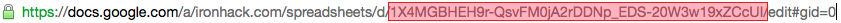

# TableClass

I have created this class because at Ironhack we use a lot Spreadsheets and excels and Google App Script to automate several background operations. This class helps us to access directly to rows and columns using for example their Column Name, the selected row or by a row id. 

Here I've create a [test spreadsheet](https://docs.google.com/a/ironhack.com/spreadsheets/d/1X4MGBHEH9r-QsvFM0jA2rDDNp_EDS-20W3w19xZCcUI/edit#gid=0).

## Constructor

```javascript
var myTable = new TableClass("1X4MGBHEH9r-QsvFM0jA2rDDNp_EDS-20W3w19xZCcUI", 
                "Sheet1", 1);  
```

+ **spreadSheetID** : You can find the the Spreadsheet ID in the Document URL

      >

+ **sheetName** : Sheet that contains the table you want to use

+ **headersRow** : In which row are the headers. Sometimes you can put the headers in the row 2 or 3, and use the above rows to metadata related to the column


## Properties

This are the properties for each object. For sure the three properties you pass by parameters: 

+ **spreadSheetID**
+ **sheetName** 
+ **headersRow**

And then some extra properties:

+ **sheet** : Linking to the SpreadsheetApp object that Google App Script provide you.

```javascript
SpreadsheetApp.openById(this.spreadSheetID).getSheetByName(this.sheetName);
```

## Methods

### orderTable ( )

It orders the table considering the headers row. 


----------------
### getActiveRow ( )

Get the row selected on the spreadsheet

----------------
### getActiveColumn ( )

Get the column selected on the spreadsheet

----------------
### getColumnIndexByName ( )

```Parameters```

+ ```columnName``` (String) : Name of the column you want to get his index

----------------
### getValueFromCell


```Parameters```

  + ```row``` (Integer)
  + ```column``` (integer)